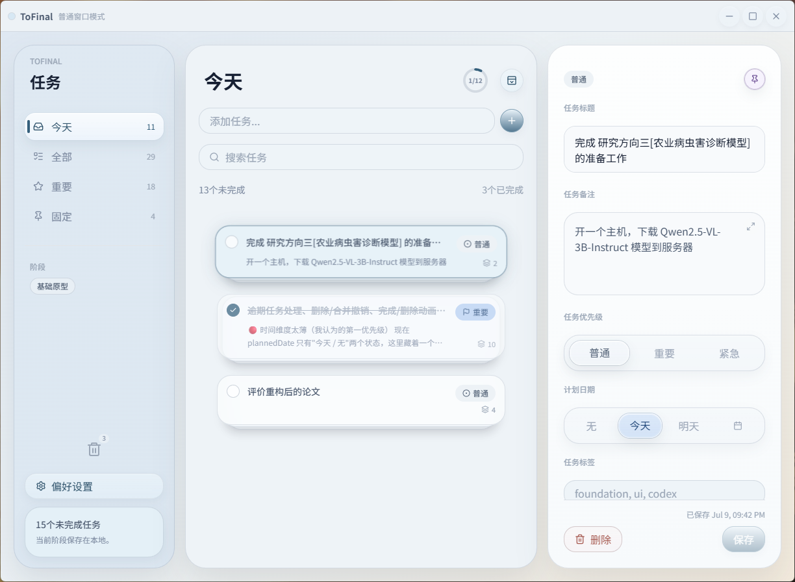
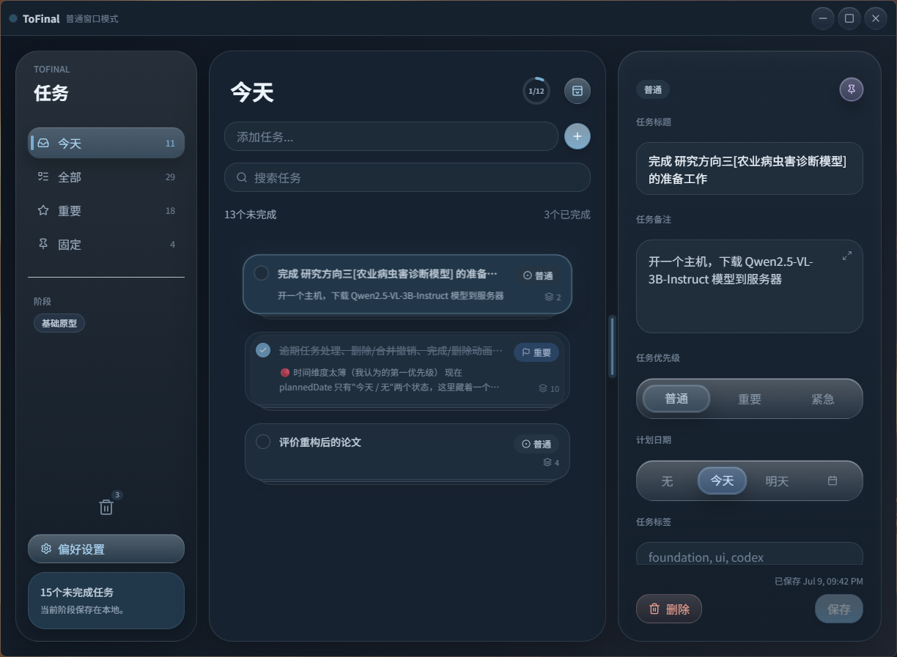

<p align="right">
  <strong>English</strong> · <a href="README.zh-CN.md">简体中文</a>
</p>

# ToFinal

A local-first, minimal desktop task manager built with [Tauri](https://tauri.app/) and React. Your tasks live entirely on your machine — no accounts, no sync, no network.

> **Note:** ToFinal is developed and tested on Windows 11. It is built with Tauri, so macOS/Linux builds may work but are currently untested. Some features (launching bound `.lnk` shortcuts, screen capture) are Windows-focused.

<p align="center">
  
</p>

<p align="center">
  
  
</p>

<p align="center"><em>Light and dark themes</em></p>

## Features

- **Two modes** — a full Normal window, and a compact always-on-top **Desktop Pin** widget for a quick glance at what's next.
- **Task stacks** — group related tasks into iOS-notification-style stacks; drag to reorder, merge, or split; single/double-click to expand.
- **Time views** — Today (with an overdue section, a progress ring, and completed-today), browse any date through a self-drawn calendar, plus All / Important / Pinned filters.
- **Planned dates & priorities** — a segmented date control (None / Today / Tomorrow / pick-a-date) and normal / important / urgent priorities.
- **Markdown notes** — write task notes in Markdown with an expandable read-only preview.
- **Attachments** — add images by OS drag-and-drop, clipboard paste, or file picker; capture full-screen or region screenshots with a built-in editor; preview in a lightbox.
- **App binding** — attach an app (`.exe` or `.lnk`) to a task and launch it in one click.
- **Trash & undo** — soft-delete with an undo toast; trashed tasks auto-purge after 30 days.
- **Local persistence** — tasks are stored in a local SQLite database, auto-backed-up on each launch (last 7 kept), and exportable to JSON or Markdown.
- **Polish** — light / dark / system themes, a glass UI, keyboard shortcuts, completion celebrations, and Simplified Chinese / English localization.

## Install

Download the latest installer from the [Releases](https://github.com/awwbugbug/Tofinal/releases) page.

> The installer is currently **unsigned**, so Windows SmartScreen may show an "unknown publisher" warning on first run. Choose **More info → Run anyway**. (See [Security & privacy](#security--privacy) for what the app can and cannot do.)

## Build from source

Prerequisites:

- [Node.js](https://nodejs.org/) 18+ and npm
- The [Rust toolchain](https://www.rust-lang.org/tools/install)
- Tauri's platform prerequisites — on Windows this is just WebView2, which ships with Windows 11. See the [Tauri prerequisites guide](https://tauri.app/start/prerequisites/).

```bash
npm install          # install frontend dependencies
npm run tauri dev    # run the app in development
npm run tauri build  # produce a release installer (in src-tauri/target/release/bundle)
```

## Development

```bash
npm test             # run the frontend test suite (Vitest)
npx tsc --noEmit     # type-check
```

## Data & storage

All data is stored locally under your user profile:

- **Database & backups:** `%APPDATA%\com.tofinal.tasks\` (SQLite file + rolling backups)
- **Attachments:** `%APPDATA%\com.tofinal.tasks\attachments\`

Nothing is sent anywhere. To move to a new machine, copy that folder.

## Security & privacy

ToFinal is offline and account-free. A few native capabilities are worth understanding:

- **App binding** launches executables you explicitly attach to a task. The app only runs paths you configure yourself; it validates that the path exists and is an `.exe` or `.lnk` before launching, and never runs anything through a shell.
- **Screenshot capture** grabs your screen(s) only when you invoke it, and the image stays local (saved as a task attachment).
- **Filesystem access** is scoped to the app's own data folder (attachments and backups) — the app cannot read arbitrary files.

## Known limitations

- Not a true desktop-embedded widget — Desktop Pin mode is a compact, always-on-top window.
- No database-corruption recovery UI yet (a damaged database currently falls back to an empty state).
- Task changes are written as full snapshots rather than row-level updates (simple and safe at typical task counts).
- Normal-mode column widths are not persisted between sessions.

## Tech stack

Tauri v2 · React 19 · TypeScript · Vite · Tailwind CSS v4 · Zustand · SQLite (`tauri-plugin-sql`)

## License

[MIT](LICENSE) © awwbugbug
